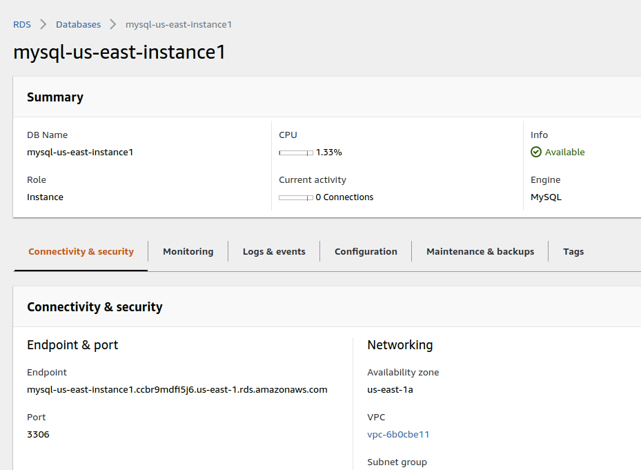
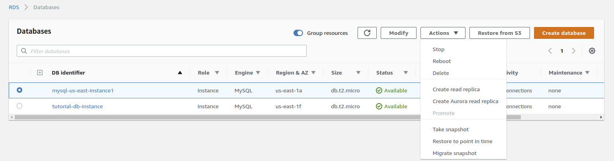

# DevOps and Cloud Based Software  
## Lab 1-3: CloudFormation and Template
University of Amsterdam

# Objectives
In this practice, you will experiment with the manual services deployment and configuration using the CloudFormation template for automatic service deployment.

The following resources will be deployed and interconnected:

- Launch EC2 instances
- Deploy a web server on EC2 instance
- Create a RDS server
- Create a Snapshot for a backup
- Create Elastic Load Balancer

# Background

This assignment is based on the AWS Academy course Cloud Computing Foundation Lab 3 EC2, Lab 5 RDS, and Lab 6 Scale & Load Balance your Architecture with additional tasks to experiment with CloudFormation functionality.

- This lab will use your knowledge and experience gained from Modules 4-8 and 10 and previous practices 2 and 3.
- You need to re-visit Module 10 -  Auto Scaling and Monitoring and Lab 6 in places where CloudFormation is used.
- Read and learn how to set up an SSH client to connect to an EC2 instance and creating a tunnel to connect to connect to the RDS Database server.  
  **Note.** Guidelines how to setup SSH client and connect to EC2 with SSH is provided on Canvas.


## Block 1. Manual creation and configuration of the LAMP Webserver

### Part A. Launch EC2 instance

Launch an EC2 instance with “Amazon Linux 2 AMI (HVM)” (e.g. selecting t2.micro).

(Note. You can choose any other OS instances, if you are comfortable.)

Make sure if your Security Group policies are open for HTTP (port 80). In case it is not open, edit Security Group policy and add HTTP - TCP rule for your specific IP for testing or 0.0.0.0/0 for everyone to access. (This helps only when you have something running. Wait until **Part B - step d**, to test it)

### Part B. Create a web server (LAMP server)

a) Connect to the ec2 instance through SSH (So, all commands below are for the deployed EC2 instance)

b) Install Apache web server with PHP (for testing)

```shell
sudo yum update -y
sudo yum install -y httpd.x86_64
sudo amazon-linux-extras install -y php7.2
sudo yum install -y php
```

c) Start the HTTP server

```shell
sudo service httpd start
```

d) Open web browser to check if server is running, if HTTP port is closed nothing will come, else it will show some test page for HTTP server.  
→ http://xxxxxxxxx.compute-1.amazonaws.com (replace xx with appropriate path for ec2 instance)

e) Auto start the webserver server with each restart of the instance

```shell
sudo chkconfig httpd on
```

f) Setting permissions for the Apache web server

```shell
sudo groupadd www
sudo usermod -a -G www ec2-user
sudo chown -R root:www /var/www
sudo chmod 2775 /var/www
find /var/www -type d -exec sudo chmod 2775 {} +
find /var/www -type f -exec sudo chmod 0664 {} +
```

### Part C. Create an RDS instance

Use the following steps to setup a MySQL database using AWS RDS service (RDS - Relational Database Service)

a) Go to RDS console  https://console.aws.amazon.com/rds/ and select MySQL and select RDS Free Tier (as alternative to Production and Dev/Test).
**Note: Be aware not requesting creation AuroraDB: It is very expensive because it is large scale relational database**

Investigate DB price options for different templates: check at the bottom “Estimated monthly costs”

b) Step 2: Specify DB details -> You can choose DB engine version. In Settings fill the following details:

- DB instance identifier:
- Master username:  (remember these details)
- Master password:  (remember these details)

c) Step 3: Connectivity: chose “Connect to an EC2 compute resource” and select the instance launched in **Part A**.

d) Step 4: Additional configuration

- Database options: choose an “Initial database name” and write it down
- Backup: No preference (change to 0/1 days - to reduce the charges for logs)
- Log exports tab: select General log
- Maintenance tab: select “Enable auto minor version upgrade” and “No preference”
- Deletion protection:  you can choose to protect database or leave it. As this just for testing, you can uncheck so that Database can be deleted.


e) Create database will take some time. Check the status in RDS → Databases → `You_Database_name`



f) Once it is created, note down the endpoint and port from “connectivity & Security” tab


### Part D. Connect RDS DB instance to Web Server

Follow the steps to create a page on EC2 instance

```shell
cd /var/www
sudo mkdir inc
cd inc
```

a) Create a file with your DB credentials to connect `dbinfo.inc` on EC2 instance at the following path `/var/www/inc/dbinfo.inc`.Change `endpoint` with endpoint noted in **Part C-e** and `Master username`, `Master password` and `Initial database name` with the info from **Part C-b and d**.

```php
<?php

define('DB_SERVER', 'endpoint');
define('DB_USERNAME', 'Master username');
define('DB_PASSWORD', 'Master password');
define('DB_DATABASE', 'Initial database name');

?>
```


b) Create a new file in the html `SampleLAMPPage.php`, in the following path
`/var/www/html/SampleLAMPPage.php` with sample content below:

```php
<?php include "../inc/dbinfo.inc"; ?>
<html>
<body>
<h1>Sample page</h1>
<?php

  /* Connect to MySQL and select the database. */
  $connection = mysqli_connect(DB_SERVER, DB_USERNAME, DB_PASSWORD);

  if (mysqli_connect_errno()) echo "Failed to connect to MySQL: " . mysqli_connect_error();

  $database = mysqli_select_db($connection, DB_DATABASE);

  /* Ensure that the Employees table exists. */
  VerifyEmployeesTable($connection, DB_DATABASE);

  /* If input fields are populated, add a row to the Employees table. */
  $employee_name = htmlentities($_POST['Name']);
  $employee_address = htmlentities($_POST['Address']);

  if (strlen($employee_name) || strlen($employee_address)) {
    AddEmployee($connection, $employee_name, $employee_address);
  }
?>

<!-- Input form -->
<form action="<?PHP echo $_SERVER['SCRIPT_NAME'] ?>" method="POST">
  <table border="0">
    <tr>
      <td>Name</td>
      <td>Address</td>
    </tr>
    <tr>
      <td>
        <input type="text" name="Name" maxlength="45" size="30" />
      </td>
      <td>
        <input type="text" name="Address" maxlength="90" size="60" />
      </td>
      <td>
        <input type="submit" value="Add Data" />
      </td>
    </tr>
  </table>
</form>

<!-- Display table data. -->
<table border="1" cellpadding="2" cellspacing="2">
  <tr>
    <td>ID</td>
    <td>Name</td>
    <td>Address</td>
  </tr>

<?php

$result = mysqli_query($connection, "SELECT * FROM Employees");

while($query_data = mysqli_fetch_row($result)) {
  echo "<tr>";
  echo "<td>",$query_data[0], "</td>",
       "<td>",$query_data[1], "</td>",
       "<td>",$query_data[2], "</td>";
  echo "</tr>";
}
?>

</table>

<!-- Clean up. -->
<?php

  mysqli_free_result($result);
  mysqli_close($connection);

?>

</body>
</html>


<?php

/* Add an employee to the table. */
function AddEmployee($connection, $name, $address) {
   $n = mysqli_real_escape_string($connection, $name);
   $a = mysqli_real_escape_string($connection, $address);

   $query = "INSERT INTO `Employees` (`Name`, `Address`) VALUES ('$n', '$a');";

   if(!mysqli_query($connection, $query)) echo("<p>Error adding employee data.</p>");
}

/* Check whether the table exists and, if not, create it. */
function VerifyEmployeesTable($connection, $dbName) {
  if(!TableExists("Employees", $connection, $dbName))
  {
     $query = "CREATE TABLE `Employees` (
         `ID` int(11) NOT NULL AUTO_INCREMENT,
         `Name` varchar(45) DEFAULT NULL,
         `Address` varchar(90) DEFAULT NULL,
         PRIMARY KEY (`ID`),
         UNIQUE KEY `ID_UNIQUE` (`ID`)
       ) ENGINE=InnoDB AUTO_INCREMENT=1 DEFAULT CHARSET=latin1";

     if(!mysqli_query($connection, $query)) echo("<p>Error creating table.</p>");
  }
}

/* Check for the existence of a table. */
function TableExists($tableName, $connection, $dbName) {
  $t = mysqli_real_escape_string($connection, $tableName);
  $d = mysqli_real_escape_string($connection, $dbName);

  $checktable = mysqli_query($connection,
      "SELECT TABLE_NAME FROM information_schema.TABLES WHERE TABLE_NAME = '$t' AND TABLE_SCHEMA = '$d'");

  if(mysqli_num_rows($checktable) > 0) return true;

  return false;
}
?>
```

c) Check the website you just created, by following the path: http://xxxxxxxxx.compute-1.amazonaws.com/SampleLAMPPage.php

d) If everything is configured correctly, data entered in this sample page will be saved in the MySQL DB on AWS.

### Part E. Create a Snapshot for a backup for RDS

a) Go to RDS console → Databases → then select `You_Database_name` check box

b) From “Actions” on top right drop-down menu select “Take snapshot” to save the database to Snapshots




c) Give a name to the snapshot and save it. (it will take some time depending on the size of database)

d) “You can not restore the database to the same name - if the database already exists in your AWS account”

- To restore the database from snapshot. Go to RDS console → snapshots
1. Select appropriate snapshot --> on top right “Actions” → “Restore snapshot”
2. Remember to double to check the all the parameters:
    - Change “DB Instance Class”:  appropriate size (In real time scenarios it might be not a good option to change, just to make sure you will not be charged anything for creating large DB instance)
    - Choose other parameters appropriately to restore the database.

e) %% Did not find anything to save snapshots to S3

f) ## This works to shit the existing database to Amazon services, “You can not restore the database to same name”

- select “Restore from S3”
1. Select engine - Select MySQL (As we have created MySQL RDS server)
2. Specify source backup details:  
   Choose sql version, S3 bucket from which backup needs to be restored.  
   IAM role: NO


### Part F. Create Elastic Load Balancer

a) Create another EC2 instance as you did in **Part A**

b) LAMP webserver installation as you did in **Part B**

c) Connect RDS DB instance to Web Server as you did in **Part D**

d) Then follow the Elastic Load Balancer steps from **Lab assignment 2 - Block 2**


## Block 2. Using CloudFormation for creation and configuration of the Sample Webserver

### Part G. Using CloudFormation with the Template for Webserver

#### G.1. Create a Webserver using CloudFormation template


a) Go to CloudFormation → Create new Stack  

If you want to design own template you can go to Design template and start working. But for this exercise go with second option:

“Choose a template” → “Upload a template to Amazon S3” → Choose file “practice04_cloudformation-sample.json”  to upload (File [`practice04_cloudformation-sample.json`](sources/cloudformation-sample.json) ). If you select this option new S3 bucket will be created to store your template. Be aware of the extra charges.

**Note:** If you choose to upload file, CloudFormation still creates S3 bucket to put file there.

b) Specify Details Tab: Choose the appropriate details for Database

- Stack name         % To identify Stack Created
- DBName             % Name of the DB to access or store
- DBPassword         % Password to connect to DB
- DBRootPassword     % root password for DB
- DBUser             % DB user - debuser
- InstanceType       % Choose required resources for EC2 instance
- KeyName            % used to connect to EC2 instance created

c) Next → Create

d) At the CloudFormation Stacks wait/refresh table

- If `CREATE_COMPLETE`, go to console and start using resource
- If `ROLLBACK_COMPLETE`, start from the beginning and possibly change template or instance size or location (be aware about costs).

e) Check CloudFormation output for Webserver URL: put webserver URL into browser and display frontpage

#### G.2. Experiment with template modification

a) Make changes to template, e.g. (i) modify Welcome page by changing text and adding image; or (ii) add creation of `SampleLAMPPage.php` in the template like in Part D (b).

### Part H. Compare manual services deployment and configuration and using CloudFormation template

Describe your experience in the report.

## Self-study questions

Note: To answer self-study questions, you may use the lecture as a starting point for further study, however additional research and readings will be required.

1. What is the purpose of the "Parameters" section in a CloudFormation template? Is it secure to store passwords in the template?

2. What operations does CloudFormation automate, and which must be manually defined? How do you do this?

3. Why is an SSH key required for CloudFormation, and how is it specified? Why CloudFormation require an existing key?

A. You need to create a fleet of webservers and other resources. What is the structure of CloudFormation template for this case? What are solutions for this with using CloudFormation and/or other cloud automation tools? Provide an example of what functionalities are available in Ansible (e.g., modules and/or tasks).

B. Which CloudFormation functions can be done in Ansible and which cannot? Provide example of both. How do Ansible and CloudFormation interact during the deployment process?


## Reporting

Prepare your report and include the following information:

1) Document your experiments in Parts B-F, including the configuration of your instances and services and few screenshots demonstrating webserver access via Internet.
2) The same for Part G Webserver deployment with the CloudFormation template.
3) Compare two approaches: manual and using CloudFormation.
4) Provide a summary of experience and observations
5) Answer at least 3 Self-study questions, including at least one question from groups {1,2,3} and {A,B}


## For reference: List of AWS Academy class Modules and Labs

### Modules

- Module 1 - Cloud Concepts Overview
- Module 2 - Cloud Economics and Billing
- Module 3 - AWS Global Infrastructure Overview
- Module 4 - AWS Cloud Security
- Module 5 - Networking and Content Delivery
- Module 6 – Compute
- Module 7 – Storage
- Module 8 – Databases
- Module 9 - Cloud Architecture
- Module 10 - Auto Scaling and Monitoring

### Labs

- Lab 1 - Introduction to AWS IAM
- Lab 2 - Build your VPC and Launch a Web Server
- Lab 3 - Introduction to Amazon EC2
- Lab 4 - Working with EBS
- Lab 5 - Build a Database Server
- Lab 6 - Scale & Load Balance your Architecture


